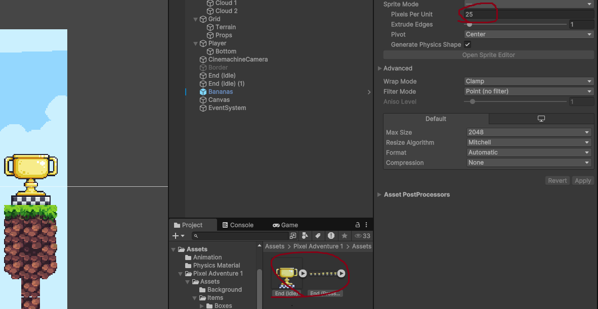
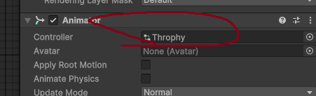
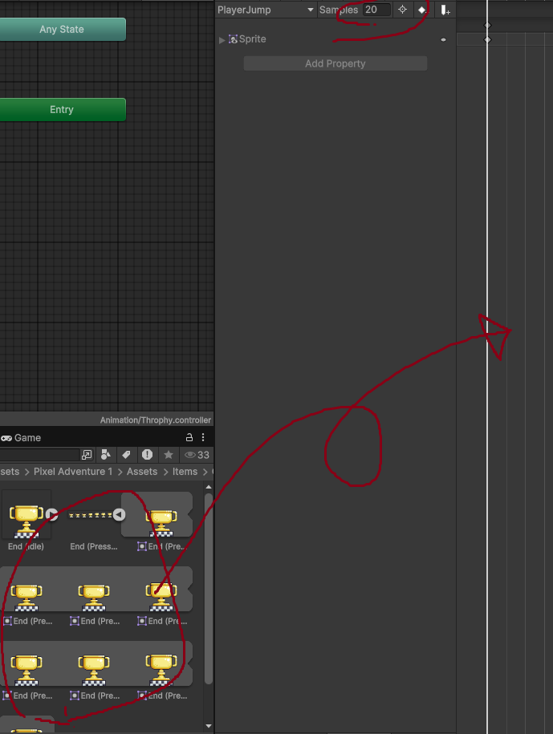
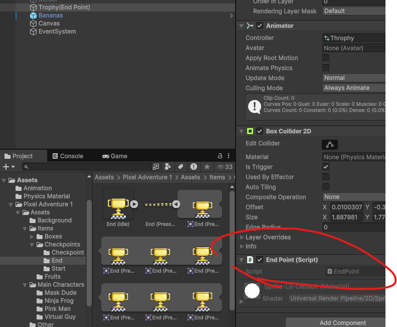
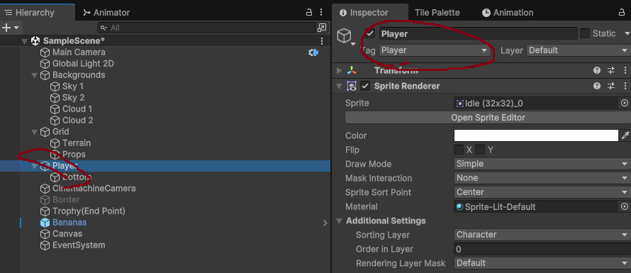

2024/10/04

# 도착지점 만들기

## 화면에 추가

트로피에셋을 도착지점으로 할거다.

Pixel Per Unit : 25



트로피를 씬에 드래그 앤 드롭 해서 생성하고 레이어를 임시로 Prop으로 설정했다.

Box Collider 2D 추가하고 크기조정, IsTrigger 체크

Animator 추가, 컨트롤러를 생성한다.

이름은 Throphy.

트로피의 애니메이터에 연동한다.



애니메이션 팝업에서 

- Window > Animation > Animation

Hierarchy에서 트로피를 선택하고 애니메이션을 만든다.

이름은 TrophyIdle.

트로피 애니메이션을 드래그 앤 드랍해 애니메이션을 생성했다.

Samples는 20정도가 적당해보였다.



이제 스크립트 작성시간

EndPoint.cs를 추가하고 트로피 오브젝트에 추가해준다.



## 스크립트 작성

일단 충돌을 잘 감지하는지 로그를 찍어본다

```cs
// EndPoint.cs
using UnityEngine;

public class EndPoint : MonoBehaviour
{
    private void OnTriggerEnter2D(Collider2D collision)
    {
        Debug.Log("Clear in EndPoint");
    }
}
```

> ## OnTriggerEnter2D vs OnCollisionEnter2D
>
> - ###  **OnTriggerEnter2D**
>
>   1. **트리거** 이벤트로, 충돌하지 않고 겹쳐지기만 할 때 호출됩니다.
>
>   2. **충돌체(Collider)**에서 **Is Trigger** 옵션이 활성화된 경우 작동.
>
>   3. 물리적 반응 없이, 충돌 감지를 위해 사용.
>
> - OnCollisionEnter2D
>
>   1. 실제 물리적인 **충돌**이 발생했을 때 호출됩니다.
>
>   2. 충돌체가 물리적으로 상호작용하며 충돌 시 발생.
>
>   3. 트리거가 아닌 일반적인 충돌에 사용.
>
>      ___
>
>      ## 요약
>
>      `OnTriggerEnter2D`: 트리거를 사용한 충돌 감지.
>
>      `OnCollisionEnter`: 물리적 충돌 감지.

___

# 아이템 추가

## 화면에 추가

먹으면 뭔가 베네핏을 주는 바나나 아이템을 추가할거다.

트로피처럼 애니메이터와 컨트롤러를 추가하고

애니메이션도 속도 알잘딱으로 만든다.

콜라이더는 Circle Collider 2D로 적당히 크기 맞추고

IsTrigger 체크.


## 아이템 충돌 처리

플레이어에 Player 태그를 달아준다.



과일과 트로피 스크립트에 충돌 대상이 "Player"인지 확인하는 코드를 작성한다.

```cs
// Banana.cs
using UnityEngine;

public class Frute : MonoBehaviour
{
    private void OnTriggerEnter2D(Collider2D collision)
    {
        if(collision.gameObject.tag=="Player")
        {
            Debug.Log("Eaten");
        }
    }
}

```

```cs
//Trophy.cs
using UnityEngine;

public class EndPoint : MonoBehaviour
{
    private void OnTriggerEnter2D(Collider2D collision)
    {
        if (collision.gameObject.tag == "Player")
        {
            Debug.Log("EndPoint");
        }
    }
}

```

